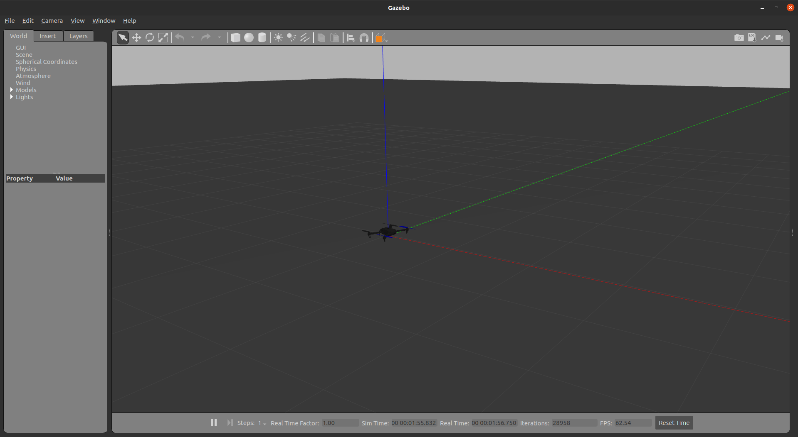

# FARC Drone

To set up your development environment, follow [these](docs/Installation.md) instructions.

After installing PX4, clone the repository inside your px4_ws/src folder and build.
```bash
cd ~/px4_ws/src
git clone git@github.com:Flying-And-Robotics-Club/farc-drone.git
cd ..
catkin build
```
This will build your entire workspace. It should build without any errors or warnings. Source your workspace by either running ```source ~/.bashrc``` or opening a new terminal.

After finishing build, try launching the simulation. You can do this by running the following command:
```bash
roslaunch farc_drone_simulation single_drone_sim.launch
```
This will make a Gazebo window pop up with a single _iris_ drone at the origin.


Now you can check your ROS topics, nodes, etc. needed for coding the drone control node.